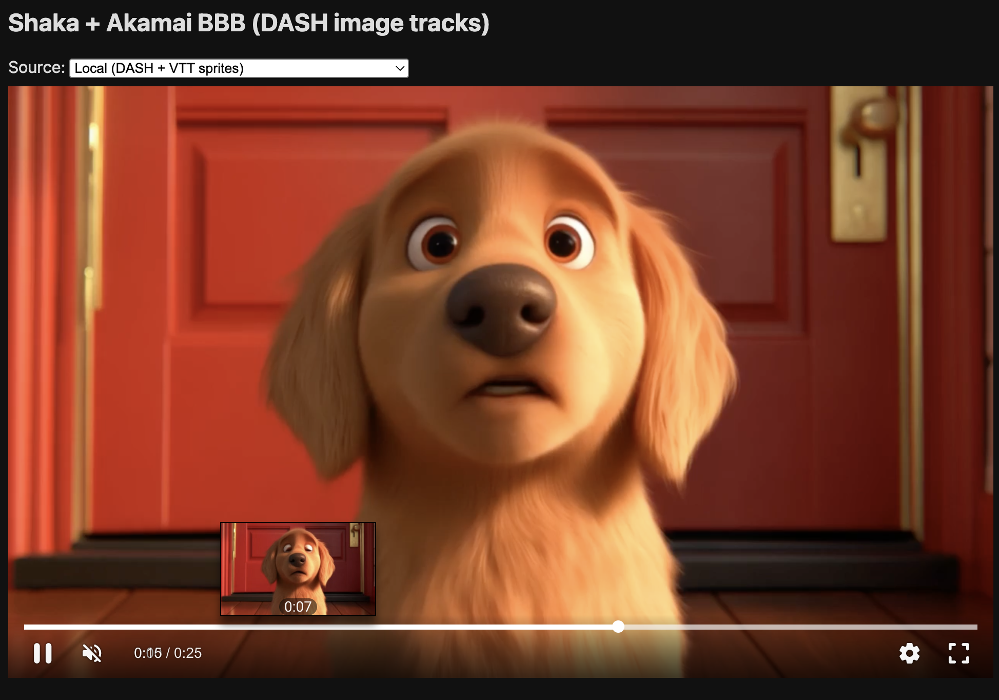

## Video Scrubbing - Streaming Demo



This project demonstrates a local video processing and streaming workflow with three components:

- generator: Encodes a local input video into DASH and HLS, generates thumbnails (VTT and tiled sprites), and injects DASH image tracks.
- streamer: NGINX server that serves the processed media with correct MIME types and CORS.
- player: A Shaka Player UI page to preview different delivery modes (Local DASH + sprites, Local HLS + sprites, Local DASH + VTT, Remote Akamai DASH).

### Getting started

Prereqs: Docker + docker compose.

1. Put a test file at `media/input/video.mp4` (or `.mkv`/`.mov`).
2. Start the stack:

```sh
docker compose up -d --build
```

3. Open the player:

- Player UI: `http://localhost:8080/`
- Streamed media served by streamer: `http://localhost:8081/video/`

4. Switch between delivery modes using the dropdown.

### Stopping the stack

```sh
docker compose down
```

### Component details

- generator
  - Watches `media/input/` for new video files (mp4/mkv/mov)
  - Outputs to `media/output/<name>/`
  - Produces (structured):
    - DASH: `dash/stream.mpd` (no image track), `dash/stream_tiles.mpd` (tiled image track), `dash/init-video-*.mp4`, `dash/chunk-video-*-*.m4s`
    - HLS: `hls/master.m3u8` (with images-only), `hls/master_noimg.m3u8` (no images-only), `hls/stream.m3u8`, `hls/chunk-*.ts`
    - Thumbnails:
      - Individual JPEGs: `thumbs/thumb-*.jpg`
      - Individual-image VTT: `thumbs/thumbs.vtt` (standard sidecar)
      - Sprites: `sprites/sprite-*.jpg` and `sprites/thumbs_sprites.vtt` (#xywh)
    - Manifests reference image tracks where standards allow:
      - DASH tiled image AdaptationSet in `dash/stream_tiles.mpd` → `../sprites/sprite-$Number$.jpg` with `EssentialProperty` `http://dashif.org/thumbnail_tile` = `COLSxROWS`
      - HLS images-only playlist `thumbs/thumbs.m3u8` + master `thumbs/thumbs_master.m3u8`
  - Tunables via environment:
    - `THUMB_EVERY_SEC` (default 2), `THUMB_WIDTH` (default 320)
    - `SPRITES_COLUMNS` (default 10), `SPRITES_ROWS` (default 10)

- streamer 
  - Serves files from `media/output/` on port 8081
  - CORS is enabled with `always` so the player on 8081 can fetch assets
  - MIME types for `.mpd`, `.m3u8`, `.ts`, `.m4s`, `.vtt`, `.jpg` are configured

- player
  - Accessible on port 8080
  - Dropdown switches between:
    1. Local (DASH + VTT sprites)
    2. Local (DASH + spriteset in AdaptationSet)
    3. Local (HLS + VTT sprites)
    4. Local (HLS + image thumbnails)
    5. Remote Akamai (DASH + image thumbnails)
  - Local sprites options add the sprite-based VTT; image-thumbnails/tiles rely on in-manifest image tracks

### How each container is constructed

- generator (`generator/Dockerfile`)
  - Alpine base with `ffmpeg`, `inotify-tools`, `bash`, `coreutils`, `jq`, `dos2unix`, `imagemagick`
  - Entrypoint `run.sh` performs one-time processing for existing files, then watches for new files
  - Uses ffmpeg for DASH and HLS, writes thumbnails, builds sprites via ImageMagick `montage`, and updates MPD for image tracks

- streamer (`streamer/nginx.conf`)
  - NGINX serving `/usr/share/nginx/html` mapped to `media/output`
  - Adds CORS headers with `always` so errors also include CORS
  - Registers MIME types for DASH/HLS/VTT/JPEG

- player (`player/Dockerfile` + `player/index.html`)
  - NGINX serves a single-page Shaka UI player
  - JS loads Shaka, initializes, and switches sources based on dropdown/URL
  - Uses sprite-based VTT for local modes to ensure reliable thumbnails across browsers

#### Local dropdown sources: file mapping

- Local (DASH + VTT sprites)
  - Manifest: `/video/dash/stream.mpd` (no image track)
  - Segments: `/video/dash/init-video-*.mp4`, `/video/dash/chunk-video-*-*.m4s`
  - Thumbnails: `/video/sprites/thumbs_sprites.vtt` → `/video/sprites/sprite-*.jpg`

- Local (DASH + spriteset in AdaptationSet)
  - Manifest: `/video/dash/stream_tiles.mpd` (includes tiled thumbnail AdaptationSet)
  - Segments: `/video/dash/init-video-*.mp4`, `/video/dash/chunk-video-*-*.m4s`
  - Thumbnails: in-MPD tiled image track → `../sprites/sprite-$Number$.jpg` (sheet layout `COLSxROWS`)

- Local (HLS + VTT sprites)
  - Variant: `/video/hls/stream.m3u8` (no image track required; VTT is used)
  - Segments: `/video/hls/chunk-*.ts`
  - Thumbnails: `/video/sprites/thumbs_sprites.vtt` → `/video/sprites/sprite-*.jpg`

- Local (HLS + image thumbnails)
  - Master: `/video/hls/master.m3u8` (references images-only playlist)
  - Variant: `/video/hls/stream.m3u8`
  - Segments: `/video/hls/chunk-*.ts`
  - Thumbnails: images-only playlist `/video/thumbs/thumbs.m3u8` (via `#EXT-X-IMAGE-STREAM-INF`)

### Standards vs custom

- DASH image thumbnails: MPD image AdaptationSet with `mimeType="image/jpeg"` and `SegmentTemplate` (standard). Tiled signaling via `EssentialProperty` `http://dashif.org/thumbnail_tile` is used by some players/tooling, but not part of ISO/IEC 23009-1.
- HLS image thumbnails: `#EXT-X-IMAGE-STREAM-INF` in master pointing to an images-only playlist with `#EXT-X-IMAGES-ONLY` (standard). No standard for tiled sprites in M3U8.
- VTT sprites: WebVTT sidecar using `#xywh` fragments to reference regions within sprite sheets (custom for players/UIs that support it; used by Shaka on web).

Player behavior note: When a manifest contains image tracks (DASH/HLS), Shaka prefers those over an added VTT thumbnails track. To demonstrate both, we provide separate manifests: `dash/stream.mpd` (no image track) and `dash/stream_tiles.mpd` (with tiles), and `hls/stream.m3u8` (no image track) vs `hls/master.m3u8` (with images-only).

References:
- [MPEG-DASH ISO/IEC 23009-1](https://standards.iso.org/ittf/PubliclyAvailableStandards/)
- [DASH-IF IOP / trick mode guidelines](https://dashif.org/guidelines/)
- [Apple HLS RFC 8216](https://www.rfc-editor.org/rfc/rfc8216)
- [Shaka Player thumbnails](https://github.com/shaka-project/shaka-player)

### Native players

- ExoPlayer (Android): supports in-manifest image tracks (DASH/HLS). VTT sprites require custom UI integration. See: [ExoPlayer](https://exoplayer.dev/)
- AVPlayer (Apple): supports HLS image playlists natively. VTT sprites require custom UI integration. See: [AVFoundation](https://developer.apple.com/av-foundation/)

### TODO / Improvements

- Add multi-bitrate ladders for HLS/DASH and proper master manifests
- Package CMAF HLS (`.m4s`) instead of TS for HLS for modern pipelines
- Extract true duration and generate exact VTT end-times from MPD timelines
- Expose more tunables (bitrate, resolution) via env and/or Makefile
- Replace polling/fetch for VTT with direct Image Tracks when Shaka reliably surfaces them for all sources
- Add health-check endpoints and better logging
- Add CI to lint and validate manifests, and run an E2E smoke test

